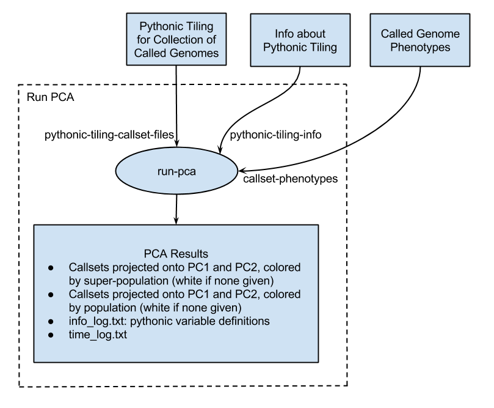

This repository contains the crunch scripts for running Principal Component Analysis (PCA)
on tiled genomes.

A diagram showing how run_pca_and_graph.py runs this code may be found at: https://workbench.su92l.arvadosapi.com/projects/su92l-j7d0g-ytu1e3983kmvlu5#Description
or below:

The pipeline template used to run this code on Arvados is at: https://workbench.su92l.arvadosapi.com/pipeline_templates/su92l-p5p6p-rzxqe2t36bq7g4s
